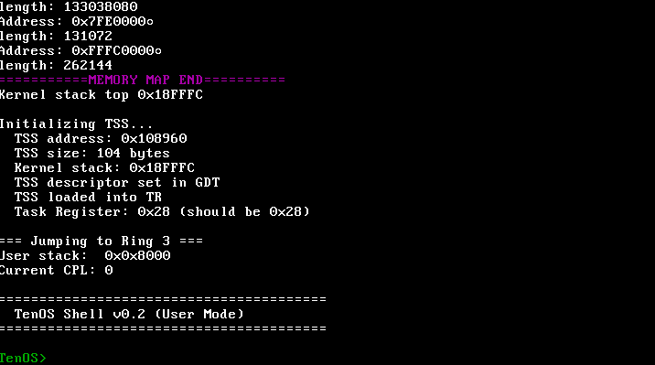
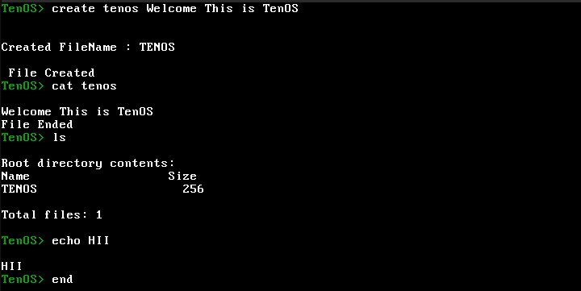

# TenOS

> **A learning project**: This is a hobby operating system kernel built from scratch to understand OS fundamentals, low-level programming, and x86 architecture.

A hobby operating system kernel written in C and x86 Assembly, featuring a complete userspace implementation with system calls, memory management, and a FAT12 filesystem.


**Note**: This project is purely educational and not intended for production use. I'm documenting my journey and may write blog posts about the implementation details in the future.

## 🚀 Features

### Core Kernel
- **Privilege Levels**: Full Ring 0 (kernel) and Ring 3 (user) separation
- **System Calls**: INT 0x80 based syscall interface for user-kernel communication
- **Memory Management**:
  - Physical Memory Manager (PMM) with bitmap-based allocation
  - Virtual Memory Manager (VMM) with paging support
  - 4KB page allocation and management
- **Interrupt Handling**:
  - Interrupt Descriptor Table (IDT) setup
  - Interrupt Service Routines (ISRs)
  - Hardware interrupt handling (IRQs)
  - Programmable Interval Timer (PIT)

### Drivers
- **VGA Text Mode Driver**: 80x25 color text output with scrolling
- **Keyboard Driver**: PS/2 keyboard with full scancode translation
  - Support for Shift, Ctrl, Alt, Caps Lock
  - Line-buffered input for user programs
- **Port I/O**: Low-level hardware communication

### Filesystem
- **FAT12 Implementation**: 
  - File creation, reading, and writing
  - Directory listing
  - Root directory support
  - Compatible with standard FAT12 floppy disk images

### User Space
- **User Mode Shell**: Interactive command-line interface running in Ring 3
- **System Call Library**: User-space wrappers for kernel services
  - `print()` - Output text
  - `read()` - Read keyboard input
  - `exit()` - Terminate process

### Utilities
- **Logging System**: Kernel logging with multiple log levels (DEBUG, INFO, WARN, ERROR)
- **String Library**: Standard C string functions (memcpy, memset, strlen, etc.)
- **Screen Management**: Clear screen, color output, cursor positioning

## 🛠️ Building TenOS

### Prerequisites
- GCC cross-compiler for i686-elf target
- NASM assembler
- GNU Make
- QEMU (for testing)
- Optional: Bochs (alternative emulator)

### Compilation
```bash
# Clone the repository
git clone https://github.com/osmten/TenOs.git
cd TenOS

# Build the kernel
make clean
make

# This will produce kernel.bin
```

### Running
```bash
# Run in QEMU
make run

# Or manually:
qemu-system-i386 -kernel kernel.bin

# Run with floppy disk image (for FAT12 testing)
qemu-system-i386 -kernel kernel.bin -fda floppy.img
```

## 🎮 Using TenOS

Once booted, you'll be greeted with the TenOS shell running in user mode (Ring 3):
```
========================================
  TenOS Shell v0.2 (User Mode)
  Running in Ring 3!
  Type 'help' for commands
========================================

TenOS> 
```

### Available Commands

| Command | Description | Example |
|---------|-------------|---------|
| `help` | Show all available commands | `help` |
| `clear` | Clear the screen | `clear` |
| `echo <text>` | Echo text back to screen | `echo Hello World` |
| `create <n> <content>` | Create a file with content | `create test.txt Hello` |
| `cat <n>` | Display file contents | `cat test.txt` |
| `ls` | List files in root directory | `ls` |
| `exit` | Exit the shell | `exit` |

## 🎯 Roadmap

- [ ] Multi-tasking and process scheduling
- [ ] More file systems (FAT32, ext2)
- [ ] Network stack
- [ ] User-space programs beyond shell
- [ ] Higher-half kernel
- [ ] SMP support
- [ ] Better UI
## 📝 License

This project is licensed under the MIT License - see the [LICENSE](LICENSE) file for details.

## 👨‍💻 Author

Created by OsmTen

## 📝 Blog Posts (Coming Soon)

I plan to write detailed blog posts explaining the implementation:
- Setting up the development environment
- Bootloader and kernel initialization
- Memory management deep dive
- Implementing system calls
- Building a FAT12 filesystem driver
- And more...

Stay tuned!

## 📸 Screenshots

### Boot and Initialization


### User Mode Shell


---

**Happy Hacking!!**
